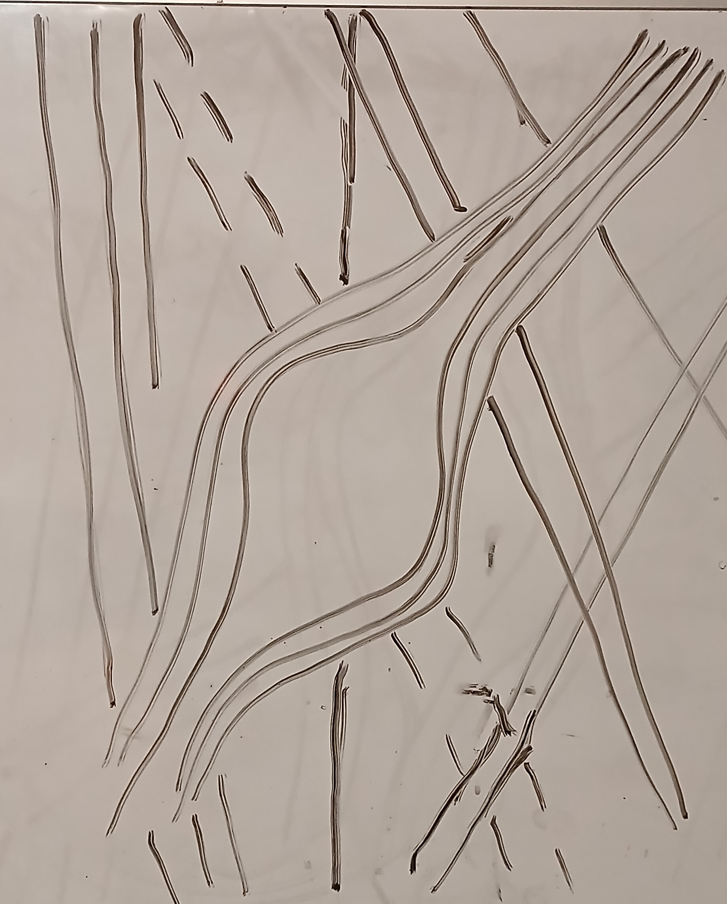
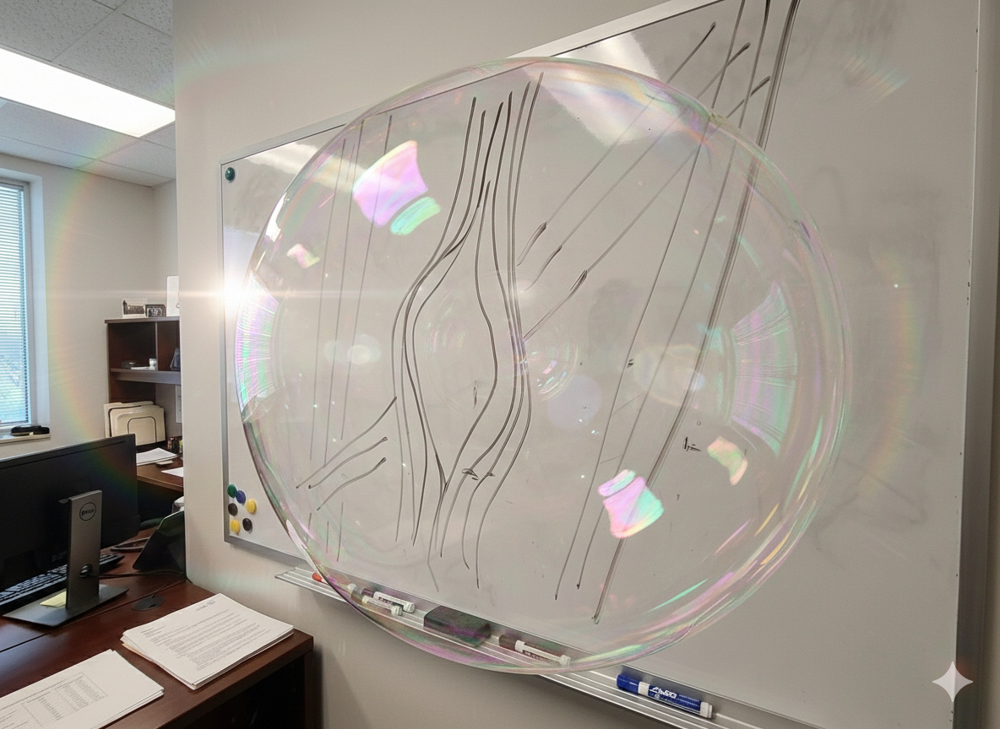

- [Thinking Ahead Again](https://share.google/aimode/7cUYZufiQiWuorUor), 2.5 years down, 2 years before rollout, 4 years to prepare for full rollout completion

# Documentation HAS to be correct and precise

1. Her: He was walking on another plane of existence
   - When was the hyperspectral visualization between the bed and wall?
   -  
   - Neurons being reactive to light allow the visualization of the formation of the bubble that warped light around it and looked more like a pointy egg?
	  
17. Him: (7/18/26 🕦 14:30): neither confirm nor deny
	- Me: If thats the case, how did it change last minute along with the use of emotional influence and manipulation?
    - 14:57 - 15:24 : silence, big mad. most likely plotting next, what to expect and prepare
    - **Brainstorm**
   
19. Her (7/19/26 🕥 11:32): Have to get him into surgery
    - Note 12 and how it verifies more so that these are ploys?
    - Him (19:12): "Suicidal"
   
---

[(1)](https://share.google/aimode/lsDCN3A9g4QSryGBL)
- first objective, use implant to coerce
- w/o revealing video. 
- under br window = kris (he's right there)
- trash = sonia, michaela.
- br: kamari (holding between camera optic and room), michaela (arm holding out) and neighbor? (reflected at the attic door). 
- neighbor and kamari on roof
- micheal in garage, but under mask??
- doesnt trust us yet (like what, serious?)

---

- This is not singular but plural. Once this is proven, you dont think everyone should take the "Jesse" test. I am obviously not the first 
- Just wait, it will be your son or daughter next. 
<!-- 
- Note: link [2](https://share.google/aimode/wRjK9mBnjBANLHI3M) no longer works. Had to deal with APT / Quantum bubbles
- Youtube blocking comments
- Re-think folder heirarchy and place in other `2 projects accordingly`. be precise and to the point, use external project links (ie - xref) for cleanliness
- Please note, that is still playing catchup, reactive vs proactive ([algorithms](https://adaptivecards.io) being narrowed down and **bugs**: i.e. access being granted before restriction)
- I believe it is **chess**, if the `nudge` wants you looking left at `Anthropic`, look right towards `Google`: **(The leading platform on AI)**
-->

- Other `3 projects`:
   * [Q](https://ophelialabs.github.io/q_compute) | [jb](https://ophelialabs.github.io/jb./) | [c2](https://github.com/ophelialabs/Platform/blob/main/fluent/cmd_cntr2/README.md#c2) - Support [main](https://ophelialabs.github.io)
    * Pay attention to what matters most!
      
   * Remember when you said you were ready? Remember when I said you giving away more information that what you were getting? You also said you would take responsibility. Or do you plan to just throw your team under the bus?
   * THINK. You send a team in the middle of the night to implant me. No terrorist acts or just pre-emptive. Have you found anything yet that you can explain that wasnt manipulation?
   * Oh yeah, you are `not` keeping this separate. How much have you spent? 

- [VoltAgent](https://github.com/VoltAgent/awesome-design-md)

---

## Ophelia
- Main
  * Julia/Pluto > [Netlify](https://www.netlify.com/)

---

## Jlabs
- [Main](https://github.com/jlabclouds) 
  * [Python](https://github.com/ophelialabs/sp-setup-) /
- [Jlab2](https://github.com/jlabcloud2)
  * [Java](https://github.com/ophelialabs/JavaUI) /

---

### Training
 - [ASE](https://ase-lib.org/examples_generated/tutorials/ase_database.html) / [MatSCI](https://matsci.org/) / [SciX](https://scixplorer.org/) ([YT](https://www.youtube.com/watch?v=7ELEYN5L49U)) 
 - [How to Code in Quantum Machine Learning for Medical Applications](https://www.youtube.com/watch?v=tqVgZ8Av6BE)
    * [ChemicalQDevice](https://github.com/kevinkawchak/LLMs-Pharmaceutical/tree/main) ([YT](https://www.youtube.com/@chemicalqdevice))
    * [DWave](https://docs.dwavequantum.com/en/latest/)
 - [Materials Project Seminars](https://www.youtube.com/c/MaterialsProject/playlists)
    * [ATAT](https://axelvandewalle.github.io/www-avdw/atat/), [Elk Code](https://elk.sourceforge.io/), [ABINIT](https://www.abinit.org/)/[VASP](https://vasp.at), [NOMAD](https://nomad-lab.eu/), [GPAW](https://gpaw.readthedocs.io/), [Icet](https://gitlab.com/materials-modeling/icet-examples/-/tree/master/tutorials?ref_type=heads) > [Together](https://share.google/aimode/addbPfeCCFVL7ojYL)
 - [Springer Training](https://www.springernature.com/gp/librarians/tools-services/learn/tutorials-training-sessions/databases)

 ---

- [arcnl](https://arcnl.nl/research-groups/materials-and-surface-science-for-euv-lithography)
