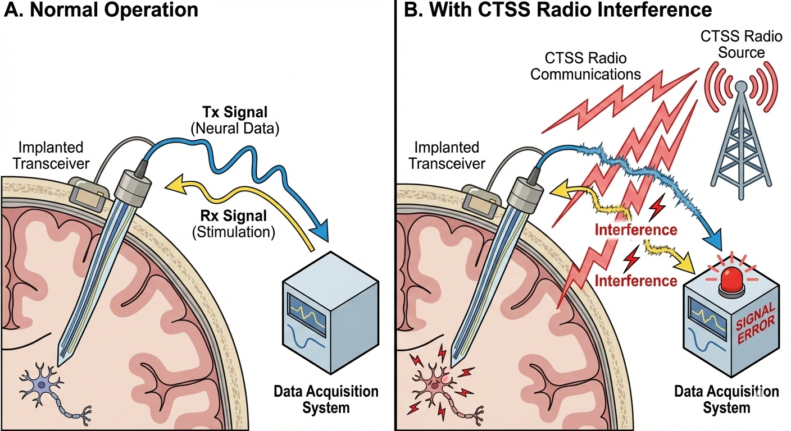

  [Journals](https://ophelialabs.github.io/journals.html) | [AAU+](#aau) | [AI](https://www.ai.mil/Initiatives/CJADC2/) | [Dashboard](https://ophelialabs.github.io/Dashboard/index.html)

  ---

  

[*CoOp Behavior*](https://www.science.org/doi/10.1126/science.adw8151) / [*Emerging fiber-based neural interfaces*](https://www.nature.com/articles/s41528-025-00465-w#Sec14)

  

[Retroauricular](#implant-index2)
**Note:** When bi-directional communication is implemented, THINK Freud (Controlled Studies), and self-analyze. What is being provoked and stay **centered**. Also, think Pavlov. Compromising someone in the middle of the night and implanting them in their sleep. How do I bring ***YOU*** out into the light?

---

### When you already have Shareholder access, apparently thanks to Salesforce and not a setup error on ADV Auto's side
- [*Appreciate the opportunity to work with older technology*](https://share.google/aimode/mxkbRlTQw23gqb3eF): Onboarding
- [Walmart / Starlight](https://share.google/aimode/a8AOBqrberZQk7ojF)
- Canary deployments ?= ?arch + ?yr (rules of 3?)
- [Power Platform](https://www.prodwaregroup.com/our-solutions/microsoft-power-platform/)
- [Power Pages](https://www.microsoft.com/en-us/power-platform/products/power-pages): functions as a secure portal for structured data exchange, often used when an organization needs to bridge the gap between internal teams and external stakeholders like vendors or partners.
- [Connectors](https://learn.microsoft.com/en-us/power-automate/): More than 400 pre-built connectors allow the platform to talk to services like Microsoft 365, Dynamics 365, Salesforce, and Google Drive.
- [Azure AI Foundry](#): This is your "Command Center." Use Prompt Flow to visualize the handoff between your Master Agent and specialized workers.
- [CopilotKit & ADK](#): Use the ADK (Agent Development Kit) to bridge your backend logic with your frontend.
- [AWS Strands](#): If you are working in the AWS ecosystem, Strands provides an "Agentic Loop" pattern (ReAct) that allows agents to reason and act autonomously within your VPC.
- **Cooking with Crisco**: A place for everything, and everything in its place!

---

  

### Verbatim (I guess Osmosis right) 
- [*How can I see what he/she sees?*](#implant-index3)
- [***Seeing behind the curtain!***](#curtain)
- [*Who are they on the phone with?*](#comm)
- [*Hand it off to me*](https://www.syglass.io/academy/v/tracing-basics-fn2tc)
- [*AI is going to learn a lot*](https://www.ai.mil/Initiatives/CJADC2/)
- [*What is the his/hers Itinerary and what is 'Our' Exit Strategy?*](#)

---

# Citations
1. Optical Quantum Ground Station for QEYSSat: Operations Planning Activities
2. [Bostonpiezooptics](https://www.bostonpiezooptics.com/optical-components): A resource for Optical Components
3. [Advances and perspectives in fiber-based electronic devices for next-generation soft systems](https://www.nature.com/articles/s41528-025-00465-w#Sec10)
4. [Advanced Materials](https://advanced.onlinelibrary.wiley.com/journal/15214095)
5. [Capacitive Soft Strain Sensors via Multicore–Shell Fiber Printing](https://advanced.onlinelibrary.wiley.com/doi/10.1002/adma.201500072)
6. [Optical Noninvasive Brain–Computer Interface Development: Challenges and Opportunities](https://secwww.jhuapl.edu/techdigest/content/techdigest/pdf/V35-N04/35-04-Blodgett.pdf)
7. [In Vivo Evaluation of Thermally Drawn BiodegradableOptical Fibers as Brain Implants](https://onlinelibrary.wiley.com/doi/epdf/10.1002/jbm.b.35549)
8. [Emerging fiber-based neural interfaces with conductive composites](https://pubs.rsc.org/en/content/articlepdf/2025/mh/d4mh01854k)
9. [HyperSpectral imaging with microcombs](https://arxiv.org/abs/2508.18219)
10. [18^th Annual](https://star.spaceops.org/2025/user_manudownload.php?doc=510__1kjy24iu.pdf)
