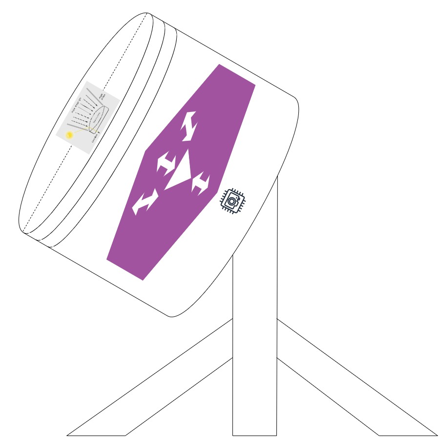

Building an eye and lens system designed to analyze light pattern differentiation-specifically for detecting subtle spatial variations, edge enhancements, or changes in surface structure-combines biological modeling with advanced machine vision technologies. A high-performance, programmable, and tunable optical system is typically used, incorporating structured light techniques, machine learning algorithms, or specialized gradient-index (GRIN) lenses to detect and interpret spatial frequencies. This system functions like a high-speed "optical auditor," capturing light data, comparing it against a known baseline, and flagging anomalies in real-time. To analyze light patterns and deviations effectively, the hardware must be matched to the specific type of deviation you are tracking: spatial (shape/position), spectral (color/wavelength), or temporal (timing/intensity).

## Core Principles for Light Pattern Analysis
To analyze differentiation in light patterns (e.g., distinguishing shapes, textures, or contrast, the system must be sensitive to spatial frequencies rather than just total light intensity.
  - **Baseline Establishment**: The system learns what "normal" looks like (e.g., a steady laser pulse or a specific sunset gradient).
  - **Contrast Sensitivity Function (CSF)**: Similar to the human eye, the system should operate on a model that samples visual input through orientation-and spatial-frequency-selective channels.
  - **Structured Light Analysis**: A projecter casts patterns (stripes, grids) onto a surface. The lens/eye system captures these patterns, and differences between the projected pattern and the captured image reveal surface topology, depth, and material differences (e.g., convex vs concave surfaces). It breaks light down into measurable attributes:
    * Intensity: Brightness fluctuations.
    * Frequency/Wavelength: Color shifts.
    * Temporal Cadence: The timing and rhythm of pulses. 
  - **Directional Lighting**: To enhance pattern differention, use lighting from multiple directions (e.g., 4-quadrant LED) to create "shape-images" that highlight edges and surface imperfections.

## Building the Lens System
  - **Gradient Index (GRIN) Lens**: Utilize a lens that mimics the human eyes GRIN structure, with a refractive index that increases from the periphery to the center, optimizing focus quality and pattern recognition.
  - **Tunable Lenses for Accomodation**: Implement a lens that can change focal length dynamically, siilar to the human eye, allowing the system to focus on objects at varying distances without oving the imaging sensor.
  - **Wide Field of View (FOV) with High Resolution**: Model the lens syste after compound eyes or specific avian eye structures to balance wide-field coverage with high-resolution foveated imaging.

## Building the "Eye" (Sensor System)
  - **Image Sensor Selection**: Use a [CCD (Charge-Coupled Device) or CMOS camera sensor] to capture the data. CCDs are generally more stable and dimensionally constant for pattern recognition. High-speed cameras, photodiodes, or spectrometers capture incoming light waves.
    * CCD/CMOS Image Sensors: High-resolution sensors (often monochrome for higher sensitivity) used to map 2D light fields. For depth or surface deviations, Structured Light 3D Cameras (like speckle projectors) project a known pattern and measure how it deforms on a surface.
    * Shack-Hartmann Wavefront Sensors: Specialized arrays of tiny lenses ("lenslets") that focus light onto a detector. By measuring the shift of these focal points, the system calculates deviations in the light's "wavefront" (phase), essential for detecting subtle optical aberrations like heat waves or lens defects.
  - **Event-Based Imaging**: For high-speed pattern changes, utilize event-based cameras. These sensor operate like biological eyes, transmitting only changes in brightness (events) rather than the whole image, allowing for 10kHz+ tracking of edge movement or pattern changes.
  - **MultiSpectral Detection**: For detailed analysis, use stacked photodetectors capable of detecting RGB and Ultraviolet (UV) light to differentiate light patterns based on wavelength. For Spectral Deviations (Color/Wavelength):
    * Optical Spectrum Analyzers (OSA): These devices use diffraction gratings or interferometers to split light into its component wavelengths. They are critical for detecting "frequency shifts" or "noise" in a laser signal that a standard camera would miss.
    * Photodiodes & Phototransistors: For simple, high-speed intensity tracking. Photodiodes offer faster response times for precision timing, while phototransistors provide higher sensitivity for detecting faint light levels.
- **For Temporal Deviations (Flicker/Pulse)**: High-Speed Digitizers: Paired with fast photodiodes to capture rapid pulses (nanosecond scale) to identify "jitter" or missing beats in a light signal.
  - **Normalization**: The system adjusts for ambient "noise" (like room lighting or weather) to ensure the raw data is clean.
  - Before light hits the sensor, it must be conditioned to isolate the signal from the noise.
    * Diffraction Gratings/Prisms: Used in spectral analysis to physically separate light waves by length, allowing the sensor to measure specific "colors" independently.
    * Spatial Light Modulators (SLM): Programmable devices that can actively shape or filter the light beam before processing, effectively performing optical "pre-calculations".
    * Beam Splitters: Divide the incoming light so it can be analyzed by multiple sensor types simultaneously (e.g., sending 50% to a camera for shape and 50% to a photodiode for timing).

## Designing for Differentiation
  - **Feature-Based Tracking**: Implement algorithms that focus on tracking specific landmarks (edges, pupil boundaries, GLINTS) instead of processing the entire picture. This immproves speed and accuracy in pattern differentation.
  - **Optical Fourier Processing**: Employ a lens setup that performs optical Fourier transforms, allowing the system to filter spatial frequencies and identify patterns in real-time.
  - **Comparison Engine**: Real-time data is layered over the baseline.
  - **Thresholding**: Small, expected flickers are ignored, while significant spikes or drops trigger a "deviation" event.
  - **Classification**: The system determines if the deviation is a known error (like a sensor glitch) or a meaningful signal (like a structural crack reflecting light differently).
  - **Feedback Loop**: Data is fed back into the baseline to improve accuracy over time (Machine Learning).
  - Real-time analysis requires moving heavy data loads without a bottleneck.
    * GPU Acceleration: Essential for processing 3D point clouds or heavy image matrices in parallel. NVIDIA cards are standard for photogrammetry and real-time rendering tasks.
    * High-Speed RAM & Storage: A minimum of 32GB-64GB RAM is often required to hold "windowed" data streams for immediate comparison. NVMe SSDs (often in RAID arrays) are necessary to stream high-bandwidth raw data without dropping frames.
    * Analog Optical Computers (AOC): Emerging hardware that uses photons instead of electrons to perform matrix multiplications (the core of pattern recognition). These systems use micro-LEDs and light modulators to process data at the speed of light, offering massive energy efficiency and near-zero latency for specific AI inference tasks.
  - Interconnects: Light data is heavy. Connections typically use Thunderbolt 4 or specialized PCIe capture cards to get data from the sensor to the processor instantly.
  - Environment Control: Precision optical hardware often requires vibration isolation tables and temperature-stabilized enclosures to prevent environmental noise from registering as a data deviation.

By leveraging [photometric stereo techniques and artifical illumination](https://youtube.com/watch?v=mVupiPxB_c8&ra=m), the system can compute surface normals to isolate material features from lighting changes, providing accurate analysis of spatial differentiation.

--- 

To analyze structures that are smooth, round, or lack tecture, you can move away from traditional "flat" imaging and use a Hexagonal Plenoptic (Light Field) Lens System.

By combining a hexagonal micro-lens array with refractive index mapping, you change the system from a "picture taker" into a "direction analyzer."

1. The Hexagonal Lens Array (Spatial Sampling)
Instead of one large lens, use an array of hexagonal micro-lenses (fly's eye geometry).
- **Why Hexagonal?** Hexagons provide the highest packing density and more uniform spatial sampling compared to squares. This eliminates the "grid bias" that can hide the subtle curves of a round, non-textural object.
- **Light Field Capture**: Each micro-lens captures a slightly different angle of the same point. For a smooth, round obect, this allows you to calculate the **Surface Normal** (the direction the surface is "pointing") even if there is no texture to focus on.

2. Gradient Refractive Index (GRIN) Integration
To enhance the analysis of light patterns without relying on surface shadows, use a GRIN lens structure:
- **Referactive Profiling**: Instead of light hitting a solid glass curve, the refractive index varies across the lens material.
- **Phase Shift Analysis**: When light passes through or reflects off a smooth, round structure, it undergoes a phase shift. A refractive lens setup can be tuned to convert these phase differences into interference patterns (Moire fringes).
- **Verifying Roundness**: By measuring how the refractive index "bends" light across the hexagonal grid, you can detect deviations in a round shape as small as a few nanometers.

3. Light Capturing Method: Differential Phase Imaging
For objects without texture, "intensity" (brightness) tells you very little. You need to capture **Phase**:
- Shack-Hartmann Wavefront Sensing: This method uses the hexagonal array to measure the "slope" of the light waves coming off the object. If the object is perfectly round, the light wavefront will be a perfect sphere. Any structural flaw or non-textural variation will cause a "tilt" in the light hitting specific hexagonal cells.
- **Polarization Gating**: Use a circular polarizer. Smooth, round surfaces change the polarization state of light based on their curvature. Your "eye" captures these polarization patterns, which act as a "synthetic texture" for your analysis software.

## Recommended Hexagonal Sensor Types
- **Hexagonal Pixel Sensors**: Sensors like the [Centeye Hawksbill]() utilize a native hexagonal array, providing tighter pixel packing and three dominant axes (60o apart) rather than two. This eliminates the need for complex interpolation and better mimics biological photoreceptor patterns.
- **Vision Sensors with Parallel Processors**: Systems such as the [SCAMP-5]() feature a pixel-parallel processor array. Each pixel has its own processsing circuitry, allowing for high-speed on-sensor computations like edge detection or event generation at low power.
- **Curved Pixel Sensors**: Emerging [curved sensors]() can simplify the optical lens requirements for round objects, improving imaging speed and accuracy in 3d measurements by matching the sensor shape to the object's curvature.

## Processing Algorithms 
Analyzing non-textural or round shapes requires moving beyond intensity-based imaging to geometric reconstruction.
- **Photometric Stereo (PS)**:
    * **Principle**: Recovers surface normals by capturing multiple images from a fixed viewpoint under different lighting directions.
    * **Application for Round Shapes**: Since PS works at a per-pixel level, it can uniquely recover the slope (surface normal) of smooth, featureless surfacess where traditional "shape from focus" fails.
    * **Optimization**: Using a [hexagonal prism]() for illumination can further optimize light distribution for 3D reconstruction.
 
  - **Hexagonal Image Processing (HIP) Algorithms:
    * **Morphological Operators**: Standard operations like dilation, erosion, and contour recognition must be adapted to the HIP-domain. Hexagonal connectivity is consistently 6-way, which reduces quantization errors compared to the 4/8-way connectivity of square grids.
    * **Fourier Slice Photography**: Used specifically for [light field cameras with hexagonal arrays](), this algorithm enables 3D reconstruction with high spatial and depth resolution (e.g., 20 um).
    * **Uncertainty-Aware Volume Rendering**: Advanced [deep learning photometric stereo] networks can combine multi-view data to recover fine details on glossy or round materials that standard algorithms might miss due to inter-reflections.

## How it works in practice
If you are analysing a smooth glass sphere for microscopic flat spots:
1. Light hits the sphere and reflects toward your hexagonal array.
2. The hexagonal lenses split the light into hundreds of sub-images.
3. The refractive analysis measures the exact angle of each ray.
4. A computer algorithm compares the measured angles to a mathematical "perfect round" model. Any discrepancy appears as a "hot spot" in the data, even if the sphere looks perfectly clear to the naked eye. 
