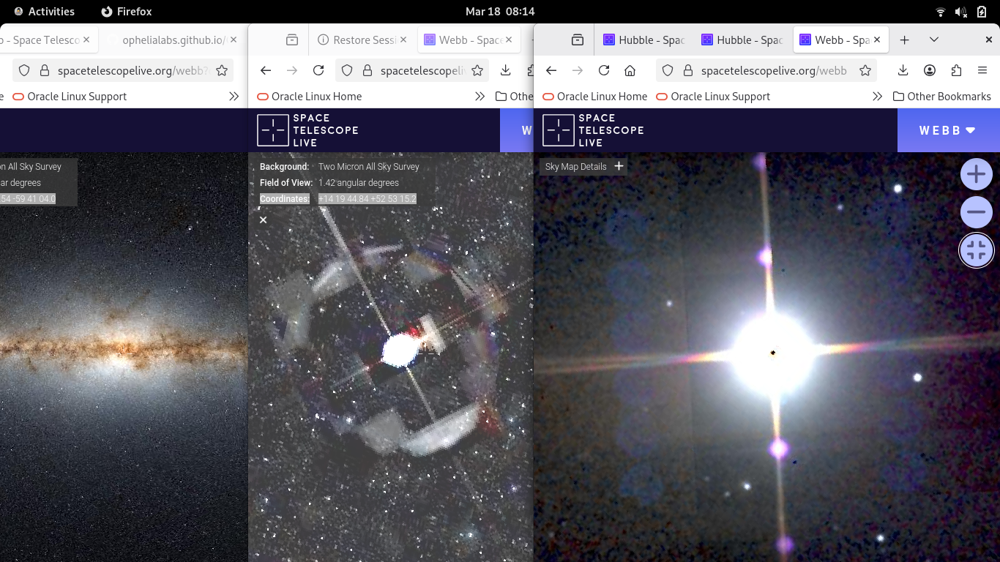
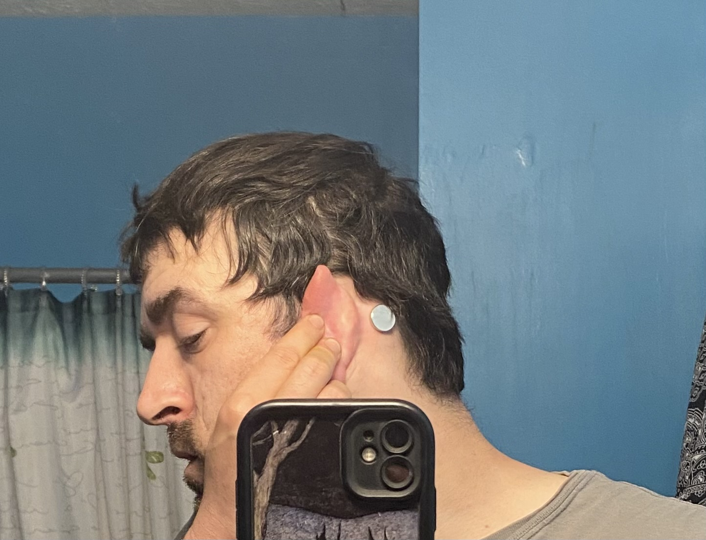
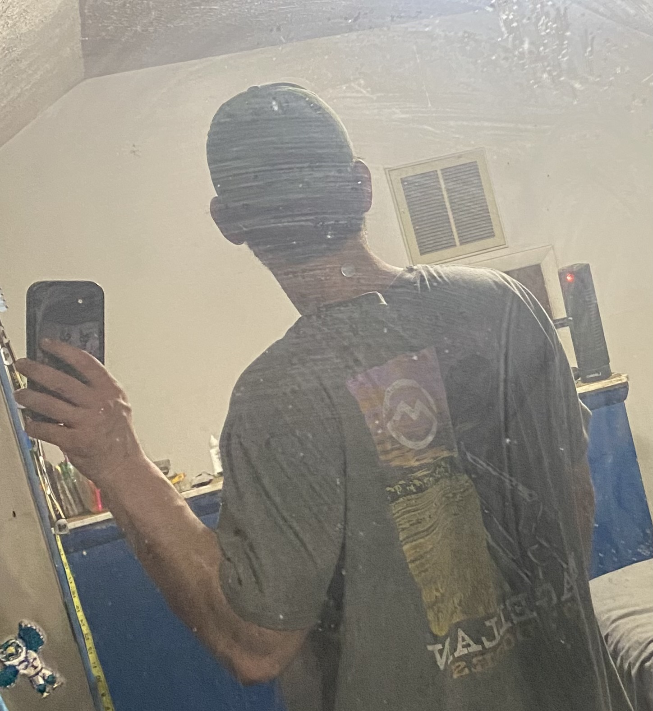
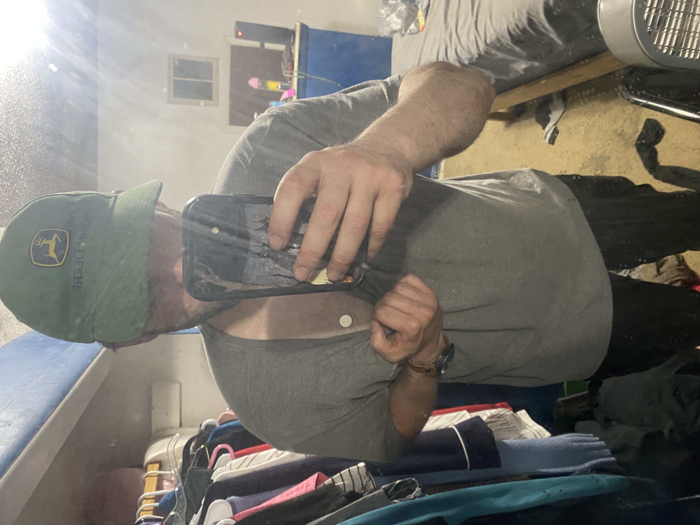

# Comes Naturally
- Read Carefully, Need to change links

[*CoOp Behavior*](https://www.science.org/doi/10.1126/science.adw8151) / [*Emerging fiber-based neural interfaces*](https://www.nature.com/articles/s41528-025-00465-w#Sec14)

---

- The [APT/ALADIN](https://share.google/aimode/OmNbSNjjehPcgIKFG) "front-facing" combination is the visual and logic engine

---

DARPA's [NESD](https://www.darpa.mil/research/programs/neural-engineering-system-design) program has developed implantable, high-resolution [neural interfaces](https://pubs.rsc.org/en/content/articlepdf/2025/mh/d4mh01854k).
Implanting them in their ***[SLEEP](#implant-index2)***. Note: Flashing light and mirrors to aid in camera detection. Think **[Bi-Directional](https://support.apple.com/en-us/106341)** Bone Anchored Hearing Systems or Behind The Ear Hearing Aids.

## Verbatim (Note: The Order of Operations)
1. "***[AI](https://www.ai.mil/Initiatives/CJADC2/)*** is going to learn a lot"
2. "How can I ***[see what he/she sees?](#implant-index3)***"
3. "Seeing behind ***[The Curtain](#curtain)***"
4. "Put them in a "***[Container](#geo-index2)***"
5. "What is his/her Itinerary? And what is the ***Exit Strategy***"

## SPLIT

**Note**: The complete absence of the [*Neodymium*](https://en.wikipedia.org/wiki/Neodymium_magnet) magnetic pole attraction next to the aluminum ***WATCH***

6. "Who are they on the ***[phone](#comm)*** with?"
7. "Trying to do our job for us. ***[Hand it off to me](https://www.syglass.io/academy/v/tracing-basics-fn2tc)***"
8. "[Lets make it deep.](#harvest-index3)" / [Self-Healing](https://www.science.org/doi/10.1126/sciadv.adx4359)
   * Bi-direction will now become "dulled"

---

## Privileges
9. 02/22/26: "They're about to get control over this"

10. 03/25/26: "I would like to reduce their amount of access"

**Note**: The Screen Saver will be a mix of the two with an orangish gradient (outside of the logo) that fills the rest of the screen

# THIS
!! Where is **`MY`** [companion](https://share.google/aimode/wRjK9mBnjBANLHI3M)**!?

---

## Two sides to every **coin**: 
10. The [***PATCH***](#Implant-index3)

---

- [NESD](https://www.darpa.mil/research/programs/neural-engineering-system-design) | [LLE](https://www.lle.rochester.edu/publications/lle-in-focus/powering-discovery-through-academic-partnerships/) | [CSDAP](https://csdap.earthdata.nasa.gov/) | [QCon](#comm-index1) | [ESnet(Deleria)](https://www.ornl.gov/news/novel-data-streaming-software-chases-light-speed-accelerator-supercomputer) | [AI](https://www.ai.mil/Initiatives/CJADC2/)
- The [Nanosat](https://github.com/ophelialabs/int-ball2_simulator) carries a Q-NET-compatible laser terminal (808 nm linearly polarized beacon laser optic), or a [high-frequency Ka-band radio](https://ophelialabs.github.io/a/pages/legacy/site-old/temp/Globe/assets/docs/Satellite-technologies.pdf) (page 34, quarter-wave dipole).
- **Optical Communication Systems**: Space-to-ground optical terminals operate at 808 nm and Ka-band frequencies for satellite communication.
- **The Link**: Fiber-based neural interfaces transmit data to a local ground terminal (running your [AWS K3](https://github.com/JesseDev3/Kube/blob/main/gke.md)/Go/Envoy stack). Note: MEG (magnetoencephalography) is non-invasive brain imaging; implantable fiber interfaces are separate technology.
- [CSDAP](https://csdap.earthdata.nasa.gov/) is a NASA data platform providing satellite imagery and geospatial data for monitoring.
- **Directions**: Current neural interfaces (like Neuralink) demonstrate motor control decoding. Advanced algorithms like [hyperQUEEN](https://www.researchgate.net/publication/370615393_HyperQUEEN_Hyperspectral_Quantum_Deep_Network_For_Image_Restoration) represent emerging ML techniques for visual reconstruction.

---

### Training
 - [ASE](https://ase-lib.org/examples_generated/tutorials/ase_database.html) / [MatSCI](https://matsci.org/) / [SciX](https://scixplorer.org/) ([YT](https://www.youtube.com/watch?v=7ELEYN5L49U)) 
 - [Generic Constraints](https://www.youtube.com/watch?v=0qtwYT4n2CM) / [.NET 2026](https://www.youtube.com/watch?v=WYBZTraXlXQ)
 - [How to Code in Quantum Machine Learning for Medical Applications](https://www.youtube.com/watch?v=tqVgZ8Av6BE)
    * [ChemicalQDevice](https://github.com/kevinkawchak/LLMs-Pharmaceutical/tree/main) ([YT](https://www.youtube.com/@chemicalqdevice))
 - [Materials Project Seminars](https://www.youtube.com/c/MaterialsProject/playlists)
    * [ATAT](https://axelvandewalle.github.io/www-avdw/atat/), [Elk Code](https://elk.sourceforge.io/), [ABINIT](https://www.abinit.org/)/[VASP](https://vasp.at), [NOMAD](https://nomad-lab.eu/), [GPAW](https://gpaw.readthedocs.io/), [Icet](https://gitlab.com/materials-modeling/icet-examples/-/tree/master/tutorials?ref_type=heads) > [Together](https://share.google/aimode/addbPfeCCFVL7ojYL)
 - [Springer Training](https://www.springernature.com/gp/librarians/tools-services/learn/tutorials-training-sessions/databases)

# Citations
1. Optical Quantum Ground Station for QEYSSat: Operations Planning Activities
2. [Bostonpiezooptics](https://www.bostonpiezooptics.com/optical-components): A resource for Optical Components
3. [Advances and perspectives in fiber-based electronic devices for next-generation soft systems](https://www.nature.com/articles/s41528-025-00465-w#Sec10)
4. [Advanced Materials](https://advanced.onlinelibrary.wiley.com/journal/15214095)
5. [Capacitive Soft Strain Sensors via Multicore–Shell Fiber Printing](https://advanced.onlinelibrary.wiley.com/doi/10.1002/adma.201500072)
6. [Optical Noninvasive Brain–Computer Interface Development: Challenges and Opportunities](https://secwww.jhuapl.edu/techdigest/content/techdigest/pdf/V35-N04/35-04-Blodgett.pdf)
7. [In Vivo Evaluation of Thermally Drawn Biodegradable Optical Fibers as Brain Implants](https://onlinelibrary.wiley.com/doi/epdf/10.1002/jbm.b.35549)
8. [Emerging fiber-based neural interfaces with conductive composites](https://pubs.rsc.org/en/content/articlepdf/2025/mh/d4mh01854k)
9. [18th Annual Space Operations Conference](https://star.spaceops.org/2025/user_manudownload.php?doc=510__1kjy24iu.pdf)
10. [HyperQUEEN: Hyperspectral Quantum Deep Network For Image Restoration](https://www.researchgate.net/publication/370615393_HyperQUEEN_Hyperspectral_Quantum_Deep_Network_For_Image_Restoration)
