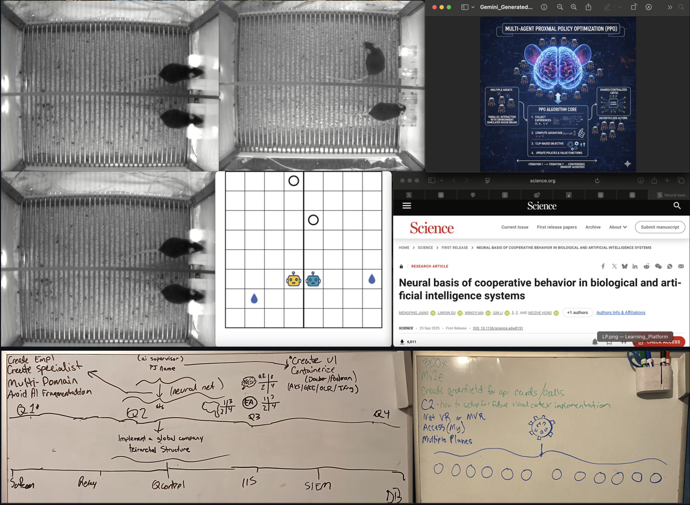
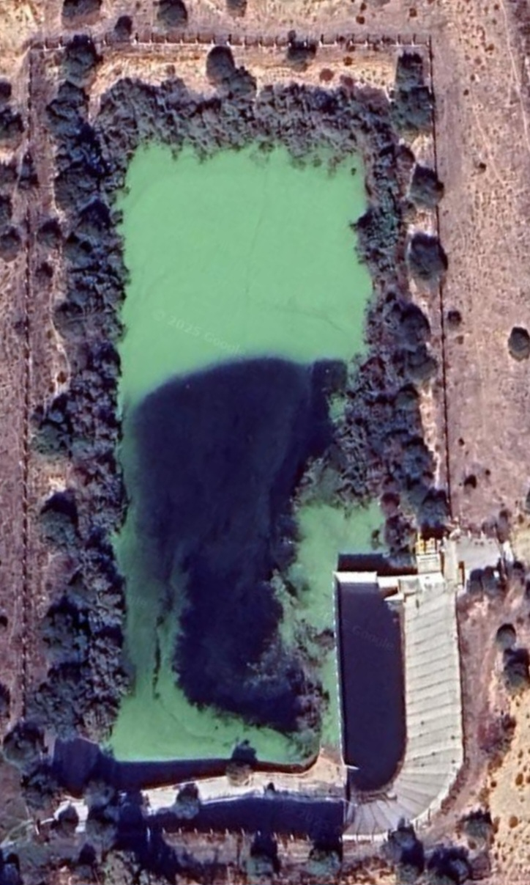

- Not your Lab Rat
- 1A: DARPA's [NESD](https://www.darpa.mil/research/programs/neural-engineering-system-design) program has developed a **minimally invasive** implantable, high-resolution [neural interface](https://pubs.rsc.org/en/content/articlepdf/2025/mh/d4mh01854k). Think **[Bi-Directional](https://support.apple.com/en-us/106341)** Bone Anchored (Cochleal) Hearing Systems, or Behind The Ear Hearing Aids.

# Let's run those simulations at the same time
## Verbatim (Note: The Order of Operations)
- How do I bring **YOU** out into the light? (Try sneaking through the **Attic** again while **I am Sleeping**) for implant. The green laser for **cognitive writing** was not satellite, but **under the barrel** in the garage. 

---

## What information did I offload, AAP?
Means atleast 08/01/23 (2.5 yrs) dissapointing on my part honestly, to present
- <wiki:Counterintelligence> | <wiki:Psychological_warfare> | [1](https://share.google/aimode/GT8QVoCJNxMhWmDjX) / [2](https://share.google/aimode/wRjK9mBnjBANLHI3M) 
- All because **I wanted to print an instructional return process sheet for my coworker**
- "Doesn't even know how to build, it will take at least 9 months to cover gaps"
- Him: **"No business sticking your nose in"**
  * Me: ... **BUT**... if I wasnt given instruction or directed otherwise...
- Whatever it is with **Salesforce** that gave **Shareholder** access during the backend transition period with Wal-Mart (eg... Shipt, Uber, Third Party Delivery (Last Mile), otherwise how do I know about [servicenow kb]() / [Sponsorship]() and how you can benefit company?... **Thats not on me**
- **Explicitly** provided instructions to join **confluence/jira**

## 12 of 12 (the LAST): Greggory (marquee)
**We May Have Something, talk offline or whatever we need to do**
   * Due diligence? / Timeline doesn't add up 
      - Was delegated **NW regional distribution manager**, then intervention
- I will always be a firm believer that once a schedule is published, if it is unpublished for changes, the affected team members whose schedule has been edited should be notified via email and text. 
      
---

## Reflections
**NOTE**: *FLASHING LIGHT AND MIRRORS AID IN CAMERA DETECTION*.
   * Look for **blurred rectangles and impressions in grass or footprints that appear behind the rectangles**
   * Cover eyes (shirt, towel, hand) and look for green and red sources of light)
   * When reviewing footage, red and green spectrums work best. 
   * If you ever feel like, or are instructed to cover mirrors or `reflective` surfaces... `DONT`

- Cochleal implants also with algae lighting up like a x-mas tree
- Him: "Better be glad you caught us on camera".
- Me: I will prove it, without it looking "fried"
- Him: "I should have never taken this job";
   * Unknown: "I thought he was your specialty?"
- Eyes magnetic? See image.jl. Scientific method here we go!

## Transript: 
1. Him: "**[AI](https://www.ai.mil/Initiatives/CJADC2/)** is going to learn a lot"
2. Him: "How can I **see what he/she sees?**" [(1)](https://ophelialabs.github.io/jb./tutorial-1/#loading-the-neural-data), [(2)](https://ophelialabs.github.io/jb./stack/#augmented-intent), [(3)](https://ophelialabs.github.io/jb./stack/#syglass-the-lens)
3. Him: "Saw behind **The Curtain **" [(1)](https://ophelialabs.github.io/jb./tutorial-2/#id-3-ethical-and-psychological-curtains)
4. Them: "Put him in a "**Container**" [(1)](https://ophelialabs.github.io/dev/03_networking/informatics2/)
5. Her: "What is his Itinerary? And what is the **Exit Strategy**"
6. Him: "Who are they on the **phone** with?" [(1)](https://ophelialabs.github.io/dev/03_networking/informatics2/#3.-Simplified-with-QICK) 
7. Him: "Trying to do our job for us. **[Hand it off to me](https://www.syglass.io/academy/v/tracing-basics-fn2tc)**"
8. Her: [He's about to get control over this](https://google.com)
    *  Me: Tried to name AI assistant "Cortana"
    *  Me: "This was built for me and you (Cortana) work for me now
       - Remember to treat it as an [internal]() tool
9. Her: "I would like to [Reduce his amount of access](https://google.com)", "A wildcard".
    - This also happens after search response from day before stated that the `K3 container` auto gives privileges
    - *See Also: [CTSS Squelch](./00_assets/03_Gemini_Generated_Image_BMI-CTSS.png)
11. Him: "[Lets make it deep.](https://ophelialabs.github.io/jb./index3/#id-2-implementation-of-shallow-mode-in-go-nesd)"
    - Note: Bi-direction will now become "dulled". Cochneal implants
    - You will now note the absence of the AI and its lack of response when called, overlays
       *  Let me find my Entra ID and k3 container
       *  Spreadsheet will only show ID (to avoid PII) but can be cross-referenced with Entra
       *  I only wanted to change my licenses and did `NOT` mess with anybody elses. 
12. Him: "This may be our last chance" [(1)](https://ophelialabs.github.io/dev/02_medical/#Last-Chance) 
13. Him: "[Find out what kind of Doctor they are]()"
14. Him (3/10/26 🕔 05:50): "Make sure the place is clean"
15. Her: "[Not unless he is psychic](https://google.com)": In Progress
    - How do I know about most of this when I posted without being informed first i.e. -
       * The "step" technique and wanting to go from battlefield to battlefield?
16. Him (7/9/26 🕥 19:03): "I'll pay extra"
    - I hope this isnt a professional in the medical field. Are you going to withhold this information from them too? Otherwise they may not take the job
    -  **Note**: This is to the point! and not updated unless the scientific method has been applied. Whether **video or not**. Use emotional baseline, **ZERO**-trust (Responding "Negative" to every subliminal thought, noting that if it feels like wordart or if you can isolate it as originating from the bottom right), and dont get **hooked**.
---

## Two sides to every **coin**: 
1. The [**PATCH**](#Implant-index3)

---

- [NESD](https://www.darpa.mil/research/programs/neural-engineering-system-design) | [LLE](https://www.lle.rochester.edu/publications/lle-in-focus/powering-discovery-through-academic-partnerships/) | [CSDAP](https://csdap.earthdata.nasa.gov/) | [QCon](#comm-index1) | [ESnet(Deleria)](https://www.ornl.gov/news/novel-data-streaming-software-chases-light-speed-accelerator-supercomputer) | [AI](https://www.ai.mil/Initiatives/CJADC2/)
- The [Nanosat](https://github.com/ophelialabs/int-ball2_simulator) carries a Q-NET-compatible laser terminal (808 nm linearly polarized beacon laser optic), or a [high-frequency Ka-band radio](https://ophelialabs.github.io/a/pages/legacy/site-old/temp/Globe/00_assets/docs/Satellite-technologies.pdf) (page 34, quarter-wave dipole).
- **Optical Communication Systems**: Space-to-ground optical terminals operate at 808 nm and Ka-band frequencies for satellite communication.
- **The Link**: Fiber-based neural interfaces transmit data to a local ground terminal (running your [AWS K3](https://github.com/JesseDev3/Kube/blob/main/gke.md)/Go/Envoy stack). Note: MEG (magnetoencephalography) is non-invasive brain imaging; implantable fiber interfaces are separate technology.
- [CSDAP](https://csdap.earthdata.nasa.gov/) is a NASA data platform providing satellite imagery and geospatial data for monitoring.
- **Directions**: Current neural interfaces (like Neuralink) demonstrate motor control decoding. Advanced algorithms like [hyperQUEEN](https://www.researchgate.net/publication/370615393_HyperQUEEN_Hyperspectral_Quantum_Deep_Network_For_Image_Restoration) represent emerging ML techniques for visual reconstruction.

---

[Informatics](https://braininitiative.nih.gov) / [NQI](https://www.quantum.gov/wp-content/uploads/2022/04/NQI-Factsheet.pdf) / [NQCO](https://www.quantum.gov/nqco/) | [QNET](https://arxiv.org/html/2508.03806v1) | [TOGS](https://aerospace.honeywell.com/us/en/products-and-services/products/emerging-technologies/space/space-communications/optical-and-quantum-ground-station#specs-tab) / [QEYSSAT](https://uwaterloo.ca/institute-for-quantum-computing/research/qeyssat) / [QKDSAT](https://www.esa.int/Applications/Connectivity_and_Secure_Communications/QKDSat_Secure_communication_via_quantum_cryptography) / [SmartTerminal™](https://google.com) | [HyperSpectral imaging with microcombs](https://arxiv.org/abs/2508.18219) 

---

# Citations
1. [*CoOp Behavior*](https://www.science.org/doi/10.1126/science.adw8151) 
2. [*Emerging fiber-based neural interfaces*](https://www.nature.com/articles/s41528-025-00465-w#Sec14)
1. Optical Quantum Ground Station for QEYSSat: Operations Planning Activities
2. [Bostonpiezooptics](https://www.bostonpiezooptics.com/optical-components): A resource for Optical Components
3. [Advances and perspectives in fiber-based electronic devices for next-generation soft systems](https://www.nature.com/articles/s41528-025-00465-w#Sec10)
4. [Advanced Materials](https://advanced.onlinelibrary.wiley.com/journal/15214095)
5. [Capacitive Soft Strain Sensors via Multicore–Shell Fiber Printing](https://advanced.onlinelibrary.wiley.com/doi/10.1002/adma.201500072)
6. [Optical Noninvasive Brain–Computer Interface Development: Challenges and Opportunities](https://secwww.jhuapl.edu/techdigest/content/techdigest/pdf/V35-N04/35-04-Blodgett.pdf)
7. [In Vivo Evaluation of Thermally Drawn Biodegradable Optical Fibers as Brain Implants](https://onlinelibrary.wiley.com/doi/epdf/10.1002/jbm.b.35549)
8. [Emerging fiber-based neural interfaces with conductive composites](https://pubs.rsc.org/en/content/articlepdf/2025/mh/d4mh01854k)
9. [18th Annual Space Operations Conference](https://star.spaceops.org/2025/user_manudownload.php?doc=510__1kjy24iu.pdf)
10. [HyperQUEEN: Hyperspectral Quantum Deep Network For Image Restoration](https://www.researchgate.net/publication/370615393_HyperQUEEN_Hyperspectral_Quantum_Deep_Network_For_Image_Restoration)
