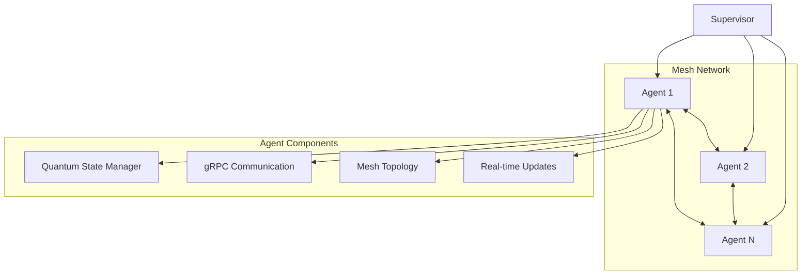

- Linux container>Cockpit>Podman>Hyrax>

- Nasa>ArcGis>https://www.esri.com/en-us/arcgis/products/develop-with-arcgis/overview
- https://developers.arcgis.com/net/install-and-set-up/
- https://docs.ckan.org/en/2.11/api/index.html
- https://catalog.data.gov/api/3 (Headers)
- https://data.nasa.gov/api/3
- https://api.nasa.gov/
- https://nasa-pds.github.io/pds-api/guides/search.html
- https://ntrs.nasa.gov/api/openapi/#/

- Elastic>Kibana>OpenStreetMapData>https://www.elastic.co/integrations/data-integrations
- Grafana/Connections/localhost:3000/connections/add-new-connection
       
- GCP>BigQuery(Optional)>Earth(Maps)>https://console.cloud.google.com/apis/library/

# ArcGis (.NET) 
- https://developers.arcgis.com/net/install-and-set-up/

# Google Earth
- https://console.cloud.google.com/apis/library/earthengine.googleapis.com?supportedpurview=project

# Azure
- https://github.com/Azure-Samples/AzureMapsCodeSamples/tree/main

# Nasa
- https://ccmc.gsfc.nasa.gov/models/?services=Runs-on-Request&statuses=Production&statuses=Result+Only
- earthdata.nasa.gov
- https://esto.nasa.gov/act/
- https://www.jpl.nasa.gov/go/opera/products/
- https://esto.nasa.gov/quantum/

# OpenDap
- https://www.earthdata.nasa.gov/engage/open-data-services-software/earthdata-developer-portal/opendap
- Hyrax Server [Linux(Cockpit '9090', Podman, Docker Img,  

# Van Allen
- https://science.nasa.gov/biological-physical/stories/van-allen-belts/

# Spring Data
- https://spring.io/projects/spring-data-cassandra

# OS
- data.gov
- https://www.transportation.gov/new-and-emerging-technologies

# Kamiokande
- https://www-sk.icrr.u-tokyo.ac.jp/en/sk/

# API
- https://www.freecodecamp.org/news/how-to-automate-api-documentation-updates-with-github-actions-and-openapi-specifications/

# Cesium 
- https://cesium.com/platform/cesium-for-unreal/

# OpenBCI
- https://openbci.com/

# Neurosky
- https://store.neurosky.com/

# Grovers Algorithm 
- https://learn.microsoft.com/en-us/azure/quantum/concepts-grovers

# LST
- https://arxiv.org/html/2310.01464v4

# Atlas
- https://apple.github.io/embedding-atlas/table.html

# Globalstar
- https://www.globalstar.com/en-us

# Space Systems
- https://advancecasper.com/wp-content/uploads/2023/05/05-COL-PETERSON_Space-Command-Overview_-Aerospace-Defense-2023.pdf

# OCI Big Data
- https://docs.oracle.com/en/middleware/goldengate/big-data/23/gadbd/overview-articles.html

# Iridium
- https://www.iridium.com/

# General Dynamics
- https://www.gdit.com/perspectives/voices-of-innovation/episode-9/blockchain-101-and-use-cases-to-help-solve-agency-challenges/

# Algorithm Visualizor 
- https://algorithm-visualizer.org/

# Learn MCP Server
- https://learn.microsoft.com/en-us/training/support/mcp

# Agent
- https://dev.to/copilotkit/heres-how-to-build-fullstack-agent-apps-gemini-copilotkit-langgraph-15jb

# ReactNet

A distributed quantum mesh network implementation with gRPC communication.

## Architecture Overview



## Quick Start

1. Install dependencies
```bash
npm install @grpc/grpc-js @grpc/proto-loader
```

2. Create a mesh network with two agents:
```javascript
const agent1 = new MeshAgent('agent1', 35.0456, -85.3097);
const agent2 = new MeshAgent('agent2', 35.9606, -83.9207);

await agent1.joinMesh();
await agent2.joinMesh();
```

3. Example quantum state transfer
```javascript
await agent1.sendQuantumState('agent2', {
    fidelity: 0.98,
    qubitCount: 10
});
```

## Features

- Bi-directional gRPC communication
- Dynamic mesh network topology
- Quantum state transfer between agents
- Supervisor coordination of the mesh network
- Real-time status updates through the mesh

## Data Format

The system uses HDF5 as its data format, which is the standard format used in various missions including:
- Orbiting Carbon Observatory 2 (OCO-2)
- Joint Polar Satellite System (JPSS)

Learn more about HDF5 standards: [NASA Earthdata HDF5 Standards](https://www.earthdata.nasa.gov/about/esdis/esco/standards-practices/hdf5)
