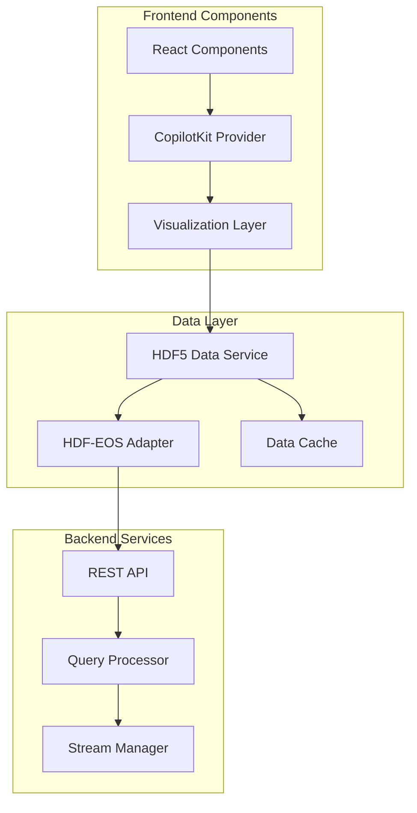
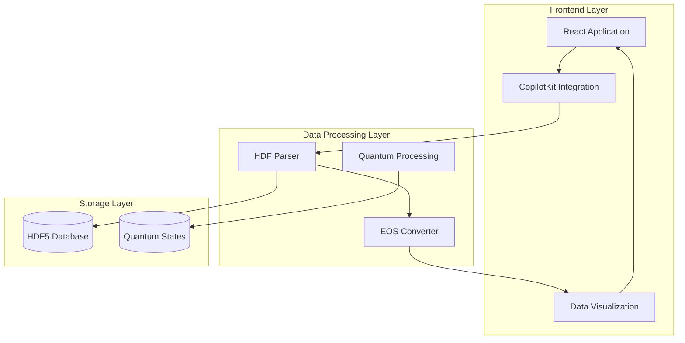

# HDF5 and HDF-EOS Data Implementation Guide

## Overview

This document outlines the implementation of HDF5 and HDF-EOS data formats in the ReactNet mission control application with CopilotKit integration.



## Implementation Details

### 1. Frontend Integration

```typescript
import { CopilotKit } from '@copilot-kit/react';
import { HDF5Viewer } from './components/HDF5Viewer';

const HDF5Component = () => {
  return (
    <CopilotKit>
      <HDF5Viewer 
        dataSource="/api/hdf5/stream"
        cacheStrategy="progressive"
        renderMode="webgl"
      />
    </CopilotKit>
  );
};
```

### 2. Data Processing Pipeline

- **Streaming Implementation**: Using WebSocket connections for real-time data updates
- **Progressive Loading**: Implementing chunked data transfer for large datasets
- **Caching Strategy**: LRU cache with configurable size limits

### 3. HDF5 Data Structure

```typescript
interface HDF5Dataset {
  metadata: {
    name: string;
    dimensions: number[];
    datatype: string;
    attributes: Record<string, any>;
  };
  data: ArrayBuffer;
}
```

### 4. CopilotKit Integration

```typescript
const copilotConfig = {
  commands: {
    'load-dataset': async (params) => {
      const { path, filters } = params;
      return await hdf5Service.loadDataset(path, filters);
    },
    'visualize-data': (dataset) => {
      return visualization.render(dataset);
    }
  }
};
```

## Key Features

1. **Real-time Data Processing**
   - Streaming HDF5 data directly from satellite feeds
   - In-memory caching for frequently accessed datasets
   - Progressive loading for large datasets

2. **Data Visualization**
   - WebGL-based rendering for large datasets
   - Custom shader support for specific data types
   - Interactive 3D visualization capabilities

3. **HDF-EOS Support**
   - Grid, Swath, and Point support
   - Coordinate system transformations
   - Metadata extraction and indexing

## Performance Optimizations

1. **Data Chunking**
```typescript
const chunkConfig = {
  maxChunkSize: 1024 * 1024, // 1MB
  concurrentRequests: 3,
  priorityQueue: true
};
```

2. **Memory Management**
```typescript
const cacheConfig = {
  maxSize: '2GB',
  evictionPolicy: 'LRU',
  persistentStorage: 'IndexedDB'
};
```

## Example Usage

```typescript
// Initialize HDF5 service
const hdf5Service = new HDF5Service({
  endpoint: 'wss://data.reactnet.org/hdf5',
  authentication: {
    type: 'JWT',
    refreshInterval: 3600
  }
});

// Load and visualize dataset
async function visualizeDataset(path: string) {
  const dataset = await hdf5Service.loadDataset(path);
  const visualizer = new HDF5Visualizer({
    container: '#visualization',
    renderer: 'webgl2'
  });
  
  await visualizer.render(dataset);
}
```

## Best Practices

1. **Memory Management**
   - Implement progressive loading for large datasets
   - Use WebAssembly for heavy computations
   - Implement proper cleanup of WebGL resources

2. **Error Handling**
   - Implement retry mechanisms for failed data loads
   - Provide fallback visualization options
   - Cache partial results for interrupted transfers

3. **Performance Monitoring**
   - Track memory usage
   - Monitor WebGL context state
   - Log data transfer metrics

## Integration with Mission Control

1. **Real-time Updates**
   - Subscribe to data streams
   - Implement delta updates
   - Handle connection recovery

2. **Data Validation**
   - Check data integrity
   - Validate coordinate systems
   - Verify metadata consistency

## Security Considerations

1. **Data Access**
   - Implement role-based access control
   - Encrypt sensitive data
   - Audit data access logs

2. **API Security**
   - Use secure WebSocket connections
   - Implement rate limiting
   - Validate all input data

## References

- [HDF5 Documentation](https://portal.hdfgroup.org/display/HDF5/HDF5)
- [HDF-EOS Tools and Information Center](https://hdfeos.org/)
- [React Documentation](https://reactjs.org/)
- [CopilotKit Documentation](https://docs.copilotkit.ai/)
````Here's the Markdown file content explaining HDF and HDF-EOS data implementation for the ReactNet mission control application:

````markdown name=temp/Globe/Data/hdf5.md
# HDF and HDF-EOS Data Implementation Guide

## Overview

This document outlines the implementation of HDF (Hierarchical Data Format) and HDF-EOS (Earth Observing System) data formats in the ReactNet mission control application with CopilotKit integration.

## Architecture Integration



## Implementation Details

### 1. React Frontend Integration
```typescript
import { CopilotKit } from '@copilot-sdk/react-core';
import { HDFViewer } from './components/HDFViewer';

const HDFDataComponent = () => {
  const handleDataLoad = async (dataset: HDFDataset) => {
    const processedData = await processHDFData(dataset);
    return processedData;
  };

  return (
    <CopilotKit>
      <HDFViewer 
        onDataLoad={handleDataLoad}
        supportedFormats={['HDF5', 'HDF-EOS']}
      />
    </CopilotKit>
  );
};
```

### 2. Data Processing Pipeline

The application processes HDF data through multiple stages:

1. **Initial Ingestion**
   ```javascript
   const ingestHDFData = async (dataSource) => {
     const hdfParser = new HDFParser({
       format: 'HDF5',
       compression: true,
       quantumStateEnabled: true
     });
     return await hdfParser.process(dataSource);
   };
   ```

2. **Quantum State Integration**
   ```javascript
   const quantumStateProcessor = {
     processDataset: (hdfDataset) => {
       return new QuantumState({
         fidelity: 0.98,
         dataset: hdfDataset,
         encoding: 'quantum-resistant'
       });
     }
   };
   ```

3. **Real-time Updates**
   ```javascript
   const streamHDFUpdates = new HDFStream({
     updateInterval: 1000,
     batchSize: 50,
     compression: 'lossless'
   });
   ```

## Data Format Specifications

### HDF5 Structure
```json
{
  "metadata": {
    "mission": "OCO-2",
    "timestamp": "2025-09-20T23:50:48Z",
    "format": "HDF5"
  },
  "datasets": {
    "quantum_states": {
      "type": "Float64",
      "dimensions": [1024, 1024],
      "compression": "gzip"
    },
    "satellite_telemetry": {
      "type": "Compound",
      "fields": ["position", "velocity", "attitude"]
    }
  }
}
```

### Integration with Mission Control

1. **Data Acquisition**
   - Direct satellite downlink processing
   - Real-time quantum state synchronization
   - Automatic format conversion

2. **Visualization Pipeline**
   - WebGL-based 3D rendering
   - Real-time telemetry displays
   - Quantum state visualization

3. **CopilotKit Features**
   - Automated data validation
   - Smart error correction
   - Predictive analytics

## Performance Considerations

- Chunked data reading for large datasets
- Quantum-classical data hybrid storage
- Parallel processing for real-time analysis

## Example Usage

```typescript
import { HDFQuantumBridge } from '@reactnet/quantum';

const initializeDataBridge = async () => {
  const bridge = new HDFQuantumBridge({
    dataFormat: 'HDF-EOS',
    quantumEnabled: true,
    compression: 'adaptive'
  });

  await bridge.connect();
  
  bridge.on('data', (packet) => {
    // Process incoming satellite data
    const quantumState = packet.getQuantumState();
    const classicalData = packet.getClassicalData();
    
    // Update visualization
    updateMissionControl({
      quantum: quantumState,
      classical: classicalData
    });
  });
};
```

## Best Practices

1. Always use chunked access for large datasets
2. Implement quantum error correction
3. Maintain data coherence between classical and quantum states
4. Regular validation of data integrity
5. Implement proper error handling for format conversions

## Error Handling

```typescript
try {
  const hdfData = await loadHDFDataset(path);
} catch (error) {
  if (error instanceof HDFFormatError) {
    // Handle format-specific errors
    quantum.correctState(error.affectedRegion);
  } else if (error instanceof QuantumStateError) {
    // Handle quantum state errors
    classical.fallback(error.stateVector);
  }
}
```

This implementation guide provides a framework for handling HDF and HDF-EOS data within the ReactNet mission control application, leveraging CopilotKit for enhanced functionality and quantum state management.
